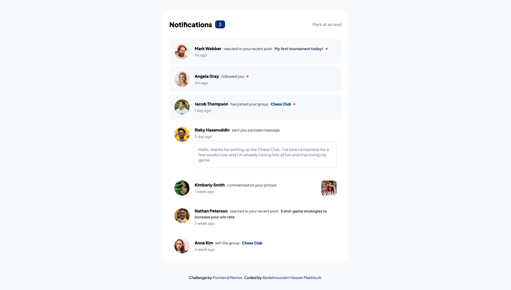
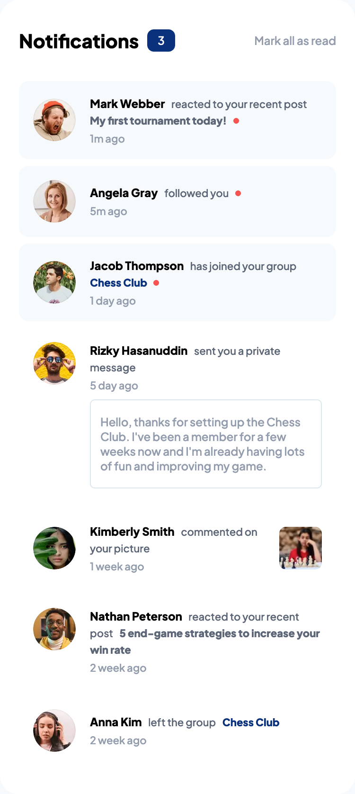

# Frontend Mentor - Notifications page solution

This is a solution to the [Notifications page challenge on Frontend Mentor](https://www.frontendmentor.io/challenges/notifications-page-DqK5QAmKbC).

## Table of contents

- [Overview](#overview)
  - [Screenshot](#screenshot)
  - [Links](#links)
- [My process](#my-process)
  - [Built with](#built-with)
  - [What I learned](#what-i-learned)
  - [Continued development](#continued-development)
- [Author](#author)

## Overview

### Screenshot




### Links

- Solution URL: [Solution URL](https://github.com/HassanMak29/frontend-mentor-notifications-page)
- Live Site URL: [Live site URL](hhttps://frontend-mentor-notifications-hassan.netlify.app/)

## My process

### Built with

- Semantic HTML5 markup
- CSS custom properties
- Flexbox
- Desktop-first workflow

### What I learned

I learned how to wrap styled paragraph.

```css
.detail {
  display: inline-block;
  line-height: 1.7rem;
}
```

## Author

- Website - [Abdelmounaim Hassan Makhloufi](https://portfolio-hassan.netlify.app/)
- Frontend Mentor - [@HassanMak29](https://www.frontendmentor.io/profile/HassanMak29)
